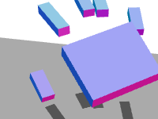
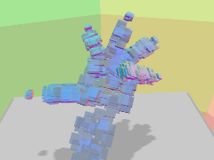
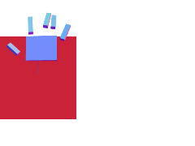
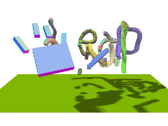
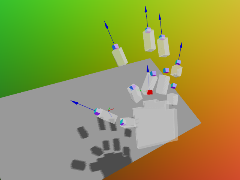
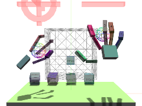

Cookbook readMe
===============

Cookbook code is an example of programming code that identifies or demonstrates a particular or specific aspect of a library or toolkit.

### Start Here

_Let's start with just one file that's not too complicated_

<table border=0 >
  <tr valign=top >
	<td width=240 >
		 
		<a href=https://github.com/jaanga/gestification/tree/gh-pages/cookbook/boilerplate ><b>Boilerplate</b></a> 
		A starting-off point file that loads the Three.js and Leap libraries and creates a simple 3D display of hands and pointables.</td>
<!--
    <td width=20 ></td>
	<td width=250 ></td>
	<td width=20 ></td>
    <td width=250 ></td>
-->	
  </tr>
</table>

### Real-time Hands

_Can you use the Leap data to design hands, claws, robot apendages, puppets, sign-language engines? Maybe not yet. But let's see if we can get a good start..._

<table border=0 >
  <tr valign=top >
  <td  width=240>
		 
		<a href=https://github.com/jaanga/gestification/tree/gh-pages/cookbook/jest-live ><b>jestLive</b></a> 
		See your motions in a lively, handy way. Choose the hand you want. </td>
    <td width=10 ></td>
	<td width=240>
		 
		<a href=https://github.com/jaanga/gestification/tree/gh-pages/cookbook/jest-play ><b>jestPlay</b></a> 
		Record and replay Leap Motion JSON and BVH data capture. Much effort here - Nearly ready for prime time.</td>
    <td width=10 ></td>
	<td width=240>
		 
		<a href=https://github.com/jaanga/gestification/tree/gh-pages/cookbook/phalanges/ ><b>Phalanges</b></a> 
		Now at R7. Base code for showing hand and fingers even when data is not available from the Leap device. Much effort here.</td>
  </tr>
</table>

<!--

 
<a href="./boilerplate/leap-threejs-boilerplate.html" ><b>Boilerplate</b></a> 
A starting-off point file that loads the Three.js and Leap libraries and creates a simple 3D display of hands and pointables. 

 
<a href="./jest-live/r1/" ><b>jestLive</b></a> 
Real-time handiness.

 
<a href="https://github.com/jaanga/gestification/tree/gh-pages/cookbook/jest-play" >j<b>estPlay</b></a> 
Record and replay Leap Motion JSON and BVH data capture. 
Much effort here - Nearly ready for prime time.

 

*  [Boilerplate](./boilerplate) - A starting-off point file that loads the Three.js and Leap libraries and creates a simple 3D display of hands and pointables. 
*  ~ real-time handiness.
*  ~ [jestPlay](https://github.com/jaanga/gestification/tree/gh-pages/cookbook/jest-play) - Record and replay Leap Motion JSON and BVH data capture. 
Much effort here - but not quite ready for prime time.

-->

### Creativity

_What sorts of new things can we design and make using six degrees of freedom?_

<table border=0 >
  <tr valign=top >
	<td width=240 >
		 
		<a href=https://github.com/jaanga/gestification/tree/gh-pages/cookbook/draw-3d-objects/ ><b>Draw 3D Objects</b></a> 
		3D printing without a printer. Could be significant - one day.</td>
    <td width=20 ></td>
	<td width=250 ></td>
	<td width=20 ></td>
    <td width=250 ></td>
  </tr>
</table>

<!--
*  ~ [Draw 3D Objects](https://github.com/jaanga/gestification/tree/gh-pages/cookbook/draw-3d-objects) - 3D printing without a printer. Could be significant - one day.
* [Gesture Tally](https://github.com/jaanga/gestification/tree/gh-pages/cookbook/gesture-tally) - See the swipes. Response to LM forum question. Code example.

*  ~ [Phalanges](./phalanges) - Now at R7. Base code for showing hand and fingers even when data is not available from the Leap device. Much effort here.
* [youGest](https://github.com/jaanga/gestification/tree/gh-pages/cookbook/yougest) - The ultimate Leap Motion data explorer. Much effort here.
* [Pointing or Not](http://jaanga.github.io/gestification/cookbook/pointing-or-not/r1/pointing-or-not.html) - Are you pointing your finger? Code example.

-->

 

### Data Gathering
*Your hands move with six degrees of freedom. That's a heck of a lot of data every second. Can we visualze the motions and the numbers simultaneously?*
 
<table border=0 >
  <tr valign=top >
  <td  width=240>
		 
		<a href=https://github.com/jaanga/gestification/tree/gh-pages/cookbook/yougest ><b>youGest</b></a> 
		The ultimate Leap Motion data explorer. Much effort here.</td>
    <td width=20 ></td>
	<td width=240>
		 
		<a href=https://github.com/jaanga/gestification/tree/gh-pages/cookbook/gesture-tally ><b>Gesture Tally</b></a> 
		See the swipes. Response to LM forum question. Code example.</td>
    <td width=20 ></td>
	<td width=240>
		 
		<a href=https://github.com/jaanga/gestification/tree/gh-pages/cookbook/pointing-or-not/ ><b>Pointing or Not</b></a> 
		Are you pointing your finger? Code example.</td>
  </tr>
</table>

 

<table border=0 > 
<tr valign=top >
	<td width=240>
		 
		<a href=https://github.com/jaanga/gestification/tree/gh-pages/cookbook/pitch-roll-yaw/ ><b>Pitch Roll and Yaw</b></a> 
		pitch, roll and yaw issues demo. Code example.</td>  
	<td width=20 ></td>	
	<td  width=240>
		 
		<a href=https://github.com/jaanga/gestification/tree/gh-pages/cookbook/leap-direction-vs-normal ><b>Leap direction vs normal</b></a> 
		aAother pitch, roll and yaw issues demo. Code example.</td>
    <td width=20 ></td>
	<td width=240>
</tr> 
</table>

 

### Fun & Games
*And saving the best for last laughs...*  
<table border=0 >
<tr valign=top >
  <td  width=240>
		 
		<a href=https://github.com/jaanga/gestification/tree/gh-pages/cookbook/touchly ><b>Touchly</b></a> 
		A bubble-popping-like game. Fun.</td>
    <td width=20 ></td>
	<td width=240>
		 
		<a href=https://github.com/jaanga/gestification/tree/gh-pages/cookbook/murgatroyd-heaven><b>Murgatroyd Heaven</b></a> 
		not an easy game. Early work.</td>
    <td width=20 ></td>
	<td width=240>
		 
		<a href=https://github.com/jaanga/gestification/tree/gh-pages/cookbook/show-of-hands ><b>Show of Hands</b></a> 
		Who is for the motion? Let's have a show of hands. Use one hand to display seven hands. The prettiest app?</td>
</tr>
</table>

 

<table border=0 >   
<tr valign=top >
	<td width=240>
		 
		<a href=https://github.com/jaanga/gestification/tree/gh-pages/cookbook/handy-videos ><b>Handy Videos</b></a> 
		Not your mother's video. Somewhat insane.</td>  
	<td width=20 ></td>	
	<td  width=240>
    <td width=20 ></td>
	<td width=240>
</tr> 
</table>

<!--
* [Handy Videos](https://github.com/jaanga/gestification/tree/gh-pages/cookbook/handy-videos) ~ Not your mother's video. Somewhat insane.
* [Leap Distance vs Normal](https://github.com/jaanga/gestification/tree/gh-pages/cookbook/leap-distance-vs-normal) - another pitch, roll and yaw issues demo. Code example.
* [Murgatroyd Heaven](https://github.com/jaanga/gestification/tree/gh-pages/cookbook/murgatroyd-heaven) - not an easy game. Early work.
* [Pitch Roll and Yaw](https://github.com/jaanga/gestification/tree/gh-pages/cookbook/pitch-roll-yaw) - pitch, roll and yaw issues demo. Code example.
* [Show of Hands](https://github.com/jaanga/gestification/tree/gh-pages/cookbook/show-of-hands) - Use one hand to display seven hands. The prettiest app?
* [Touchly](https://github.com/jaanga/gestification/tree/gh-pages/cookbook/touchly) ~ A bubble-pooping-like game. Fun.
-->

 

###Change log

2013-10-25-30 ~ Theo  
* Too many changes, too fast
* Complete UI overhaul
 

2013-10-01 ~ Theo  
* Added Boilerplate and Phalanges  
* Updated Read Me  

2013-09-02 ~ Theo  
* Adding links  