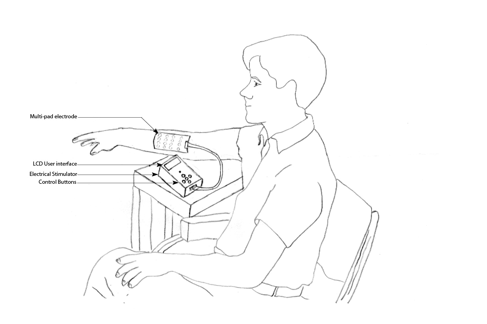

Move Quant Read Me
====

### Live Demo

<iframe src="http://jaanga.github.io/gestification/projects/move-quant/move-quant-replay/latest/" width=100% height=500px class='overview' >
There is an `iframe` here. It is not visible when viewed on github.com/fgx. To view, please go to fgx.github.io. See 'Project Links' just below.
</iframe>
[Move Quant Replay - latest]( http://jaanga.github.io/gestification/projects/move-quant/move-quant-replay/latest/ )

## Concept

### Mission

From email of [Vinil T C]( http://cmcvellore.res.in/Bioengineering/people/students/vinil/index.html ) of April 8, 2014

>    Use the Leap Motion device to track the movements of wrists and fingers.
>    Quantify the amount of movement imparted by a neuroprosthesis for patients with spinal cord injury or stroke 
>
>    To be used in conjunction with devices that artifically stimulate forearm flexor and extensor muscle groups 
>    for getting the graping movement in fingers and wrist.  

_Image of neuroprosthesis supplied by Vinil T C_

###Vision

## Features
To the basic [Jest Replay JSON]( https://github.com/jaanga/gestification/tree/gh-pages/cookbook/jest-play) script, this app adds adds:  

* Frame ID 
* Limited replay speed adjustment

For wrists and fingers:  

* XYZ position readout
* Direction vector
* Velocity vector 

## Road Map

## Issues /Bugs

## Background

Vinil T C says:

>    I am currently studing for a masters ( MS) in Bioengineering at [Christian Medical College]( http://en.wikipedia.org/wiki/Christian_Medical_College_%26_Hospital ), Vellore, India. Our department works closely with Physical Medicine and Rehabilitation unit. 
>    The Rehabilitation Institute at CMC is one of the best Rehabilitation centers in India. 
>    In our group we have clinicians, therapists, bioengineers working together towards implementing various rehabilitation needs for patients with various motor disabilities. 

>    I am basically interested in upper limb assistive technologies.
>    My current project is a upper limb neuroprosthesis based on [Functional Electrical Stimulation]( http://en.wikipedia.org/wiki/Functional_electrical_stimulation ) 
>    for regaining grasp in patients with spinal cord injury or stroke - particularly  for C5-C6 SPI patients.

>    The device is a combination of 16 channel electrical stimulators with matching multi electrode arrays. 
>    This electrode array is fixed on forearm. With the user interface of the stimulator , you can control current for reach of the electrode and there by injucting current through some combination of electrodes. I can regenerate the grasping action; (Extension of wrist+Flexion of Fingers)

>    I plan to use the Leap Motion device to help with quantifying the movements of wrists and fingers.
>    I need to get coordinates on each fingers and wrist at different time instants and, by manipulating that data, calculating the displacement of the fingers and wrist.

>    My department Student profile link <http://cmcvellore.res.in/Bioengineering/people/students/vinil/index.html>
>    A short discription about my work <http://cmcvellore.res.in/Bioengineering/people/students/vinil/vtc_res.html>

## Project Links

You have two ways of viewing the Move Quant files:

* Web page hosted on GitHub: [jaanga.github.io]( http://jaanga.github.io/gestification/projects/move-quant/ "view the files as apps." ) <input value="<< You are now probably here." size=28 style="font:bold 12pt monospace;border-width:0;" >  
* Source code on GitHub: [github.com/jaanga]( https://github.com/jaanga/gestification/tree/gh-pages/projects/move-quant "View the files as source code." ) <scan style=display:none ><< You are now probably here.</scan>

### System Requirements

In order to view the files on this site you will need a device and browser that provides good support for [WebGL](http://get.webgl.org/)
WebGL is the JavaScript API for rendering interactive 3D graphics and 2D graphics within any compatible web browser without the use of plug-ins. 

Generally this means a computer with an Intel Core i5 processor or better with an external GPU such as one made by Nvidia. 
Successful use of the apps on a phone or tablet is highly unlikely. 
A mouse or other pointing device with a scroll wheel is also highly recommended so that you can zoom, pant and rotate in 3D.
 
The apps here are currently being built and tested with the Google Chrome browser. 
Bugs on browsers other than Chrome need not be reported until such time as the work settles down and an effort to support more browsers is initiated.

### Copyright and License

[Jaanga copyright notice and license]( https://github.com/jaanga/jaanga.github.io/blob/master/jaanga-copyright-and-mit-license.md )

This repository contains files that are  at an early and volatile stage. Not all licensing requirements may have been fully met let alone identified. It is the intension of the authors to play fair and all such requirements will either be met or the feature in question will turned off.

### Change Log

2014-04-16 ~ Theo

* Direction and velocity added
* Replay speed adjistment aded
* Frame ID added

2014-04-14 ~ Theo

* First commit

